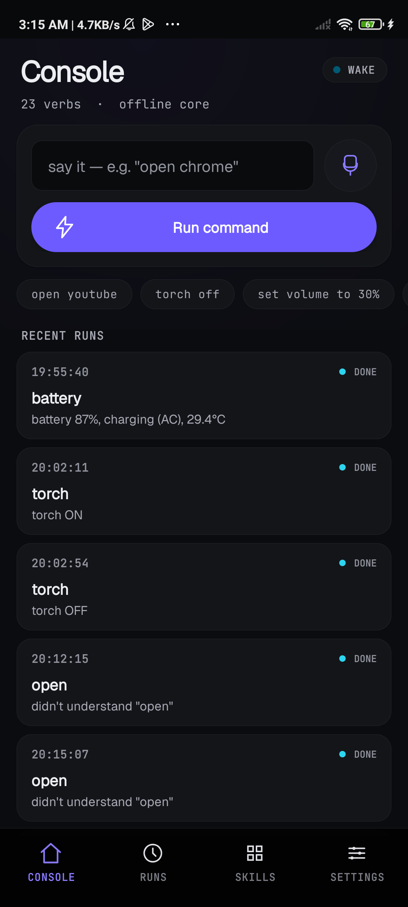
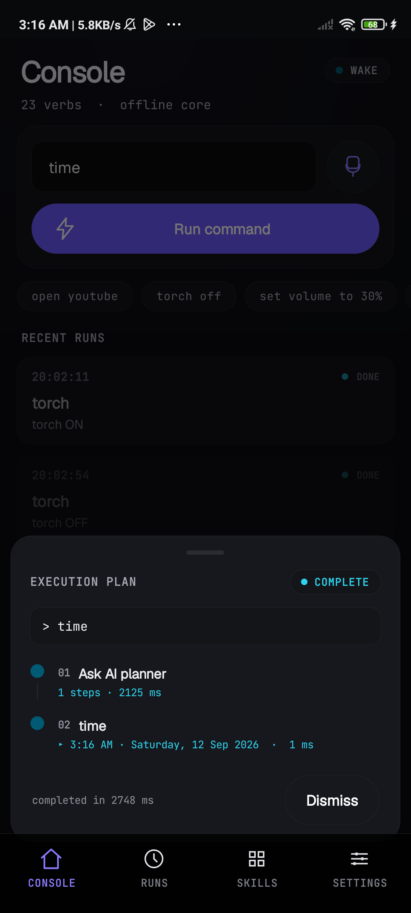
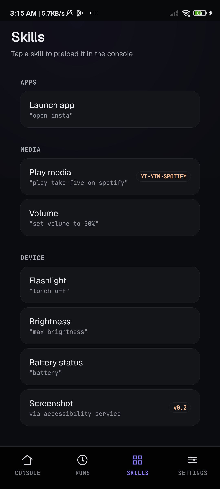
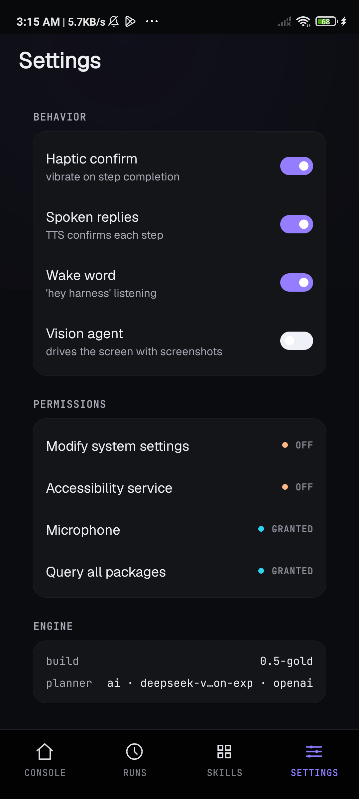

# Pocket Harness

**Talk to your phone. It does the thing.**

Pocket Harness is a single ~250 KB APK that turns plain English — typed or spoken
— into real actions on Android: open apps, play music, torch, volume, brightness,
calls, texts, maps, search. No PC, no adb, no server, no Play Store. The offline
brain works instantly; add an AI endpoint and it plans multi-step tasks; flip a
switch and a vision agent drives the screen through screenshots.

<p align="center">
  
  
  
  
</p>
<p align="center"><sub>Console · live execution plan · skills · AI engine — real screenshots from 0.5-gold</sub></p>

```text
you →  open instagram
       ▸ opened Instagram

you →  torch off and set volume to 30%
       ▸ torch OFF
       ▸ media volume → 30%

you →  play tu hi to hai
       ▸ asked YouTube to play "tu hi to hai"
```

**23 built-in verbs · offline core · Android 7.0+ · zero libraries, one dex**

## Install

1. Grab [`PocketHarness.apk`](PocketHarness.apk) (or build it below).
2. Copy to your phone, tap it, allow "install unknown apps".
3. Open the app and walk through onboarding: grant microphone; optionally enable
   the **Accessibility service** (screen control) and **Modify system settings**
   (brightness).

## What it can do

### Offline verbs — always on

| Say this | What happens |
|---|---|
| `open youtube` / `launch insta` | fuzzy-matches **every installed app** (typos OK, aliases like `yt`/`wa`/`tg`) |
| `play tu hi to hai` | `MEDIA_PLAY_FROM_SEARCH` → YouTube auto-plays |
| `play take five on spotify` | Spotify deep-link · also `on ytmusic` / `on youtube` |
| `volume up` · `set volume to 30%` · `mute` · `unmute` | AudioManager |
| `brightness 40%` · `max brightness` | system settings |
| `torch on` · `flashlight off` · `torch` | camera flash (bare `torch` toggles) |
| `call 9876543210` · `text mom saying omw` | dialer / SMS draft |
| `navigate to kempegowda airport` | Google Maps |
| `search for best filter coffee` · `google …` | Chrome → web search |
| `battery` · `time` · `camera` · `wifi settings` · `bluetooth settings` | quick answers / system panels |
| `share <text>` · `screenshot` · `help` | share sheet / capture / verb list |
| `… and …` / `… then …` | chain any of the above |

Unknown input gets an honest `?` plus suggestions — the agent never silently
dead-ends.

### Screen control — with Accessibility

| Say this | What happens |
|---|---|
| `tap 500 300` | tap by 0–1000 normalized coordinates |
| `tap search` | heuristic tap (search / address bar) |
| `type <text>` · `press enter` | fill the focused field · submit (Android 11+) |
| `swipe up` / `swipe down` | scroll |
| `back` · `home` | global navigation actions |

### Voice

- **Hold-to-talk** — tap the mic, an in-app speech sheet opens (no system
  dialog), the transcript runs.
- **Wake word (v0.4)** — say `"hey harness"` and it listens for a command.
  Foreground-only; pauses while hold-to-talk is active.
- **Spoken replies** — optional TTS confirmation per step.

### AI planner — optional

The instant an endpoint + model are set, commands go to an LLM that breaks them
into clauses, then the same on-device skills execute them. One-tap presets in
`Settings → ai engine`:

| Preset | Endpoint | Transport | Default model |
|---|---|---|---|
| **ZEN** | `https://opencode.ai/zen/v1` | openai | `nemotron-3-ultra-free` |
| **OPENROUTER** | `https://openrouter.ai/api/v1` | openai | (pick one) |
| **GO** | `https://opencode.ai/zen/go/v1` | openai | `glm-5.3-flash` |
| **SELF-HOST** | your LAN `opencode serve` | opencode | `provider/model` |

- **Two transports:** OpenAI-compatible `POST /chat/completions`, or native
  opencode `POST /session` → `/session/{id}/message`.
- **Live model dropdown** from `GET /models` (OpenAI) or `GET /config` (opencode).
- **Stable session id** sent as `x-opencode-session` (OpenCode Go requires it).
- **Test connection** probes reachability, auth, and parsing.
- **Never dead-ends:** planner failure falls back to the offline rule splitter.

Byte-for-byte HTTP contracts live in [`API-CURL.md`](API-CURL.md).

### Vision agent — optional

With Android 11+, Accessibility enabled, and `Settings → Vision agent` on, the
app runs an observe → act loop:

1. Screenshot the screen and the accessibility node tree, then draw **numbered
   boxes** over every clickable element (set-of-mark).
2. Send the goal + last 5 actions + marked JPEG + the `#id "label"` element list
   to the vision model.
3. Get back **exactly one** action: `click #N` (preferred), `open`, `tap x y`,
   `type`, `press enter`, `swipe up/down`, `back`, `home`, `wait`, `done`, or
   `fail`.
4. Execute (element taps use the node's exact bounds — no coordinate guessing),
   log, screenshot again — capped at 16 steps.

Deterministic clauses in a command (`open …`, `search for …`, `volume …`) run
through the offline rules instantly; only on-screen actions hit the vision
model. Without a vision model, vision falls back to raw coordinate taps.

Commands with a `click/select/…` clause auto-enter this mode; `Settings → Vision
agent` forces it for every command.

## How it works

```
                      AI planner enabled?
 command ──▶ ┌───────────────┴───────────────┐
             │ no                            │ yes
             ▼                               ▼
     rules v1 (Harness)            AI planner (AIClient)
     offline · always on           opencode | openai transport
             │                               │ error → rules fallback
             └───────────────┬───────────────┘
                             ▼
                    skills execute (Harness)
                             │ vision toggle / chrome+search
                             ▼
          vision agent: screenshot → model → 1 action
          (HarnessService: gestures, text, capture)
```

| File | Role |
|---|---|
| `MainActivity.java` | all UI (Console/Runs/Skills/Settings), onboarding, orchestration, voice + wake word, vision loop, history (~2,500 lines) |
| `Harness.java` | offline rule engine: clause splitter → router → skill handlers |
| `AIClient.java` | HTTP layer: both planner transports, vision step calls, model listing, plan parsing |
| `HarnessService.java` | AccessibilityService: taps, swipes, text input, back/home/enter, screenshot → base64 |

Execution runs off the UI thread so blocking skills never trigger an ANR.
History (last 50 runs) lives in `SharedPreferences`.

## Build from source

Gradle-free by design — `aapt2 → javac → d8 → zipalign → apksigner`, the whole
pipeline is ~70 lines of shell. The toolchain (JDK 17 + platform-34 +
build-tools 34.0.0) is fetched into `../toolchain/`:

```bash
./setup-toolchain.sh   # one-time download (~400 MB)
./build.sh             # → PocketHarness.apk (signed, zipaligned)
```

- `fetch-sdk-pieces.sh` is a fallback that pulls the SDK zips directly if
  `sdkmanager` misbehaves.
- `npm run setup` / `npm run build` are wired up in `package.json`.
- The signed APK is produced with the checked-in debug keystore.

## Development & testing

- **Fake engine** — `python3 fake_opencode_server.py` speaks both transports on
  `0.0.0.0:8765` and always plans `["torch off", "time", "battery"]`. Point the
  SELF-HOST preset at `http://<lan-ip>:8765`.
- **Planner probe** — `python3 test_zen.py` sends the exact planner prompt to the
  free Zen tier and prints raw + parsed replies.
- **Drive it from adb** — `MainActivity` accepts intent extras:

  ```bash
  adb install -r PocketHarness.apk
  adb shell am start -n com.pocketharness/.MainActivity \
    --es cmd "open youtube and play tu hi to hai"
  ```

  | Extra | Type | Effect |
  |---|---|---|
  | `cmd` | string | prefill and run a command |
  | `ai_ep`, `ai_model`, `ai_mode`, `ai_key` | string | update planner config |
  | `ai_on` | bool | enable/disable the AI planner |
  | `ai_models` | bool | open Settings + model picker |
  | `ai_test` | bool | open Settings + run connection test |

## Permissions

| Permission | Why |
|---|---|
| `QUERY_ALL_PACKAGES` | fuzzy-launch any installed app |
| `WRITE_SETTINGS` | brightness |
| `RECORD_AUDIO` | hold-to-talk + wake word |
| `VIBRATE` | haptic confirmation |
| `INTERNET` | AI planner (optional) |
| Accessibility service | gestures, text input, screenshots |
| cleartext traffic | LAN `opencode serve` is plain http |

## Project layout

```
pocket-harness/
├── PocketHarness.apk          # signed build (0.5-gold)
├── build.sh                   # aapt2 → javac → d8 → zipalign → apksigner
├── setup-toolchain.sh         # one-time SDK/JDK download
├── fetch-sdk-pieces.sh        # sdkmanager-free SDK fallback
├── fake_opencode_server.py    # dual-transport test server
├── test_zen.py                # planner prompt probe
├── API-CURL.md                # exact HTTP contracts
├── apk-project/               # manifest, res, java sources
├── design/                    # mockups + iteration screenshots
└── build/                     # intermediates (gitignored)
```

## Roadmap

- Generalized vision planning (the loop exists; auto-trigger is currently the
  Chrome/search path)
- Contact lookup (`READ_CONTACTS`) and richer SMS flows
- Floating bubble overlay / true background wake word
- Screenshot support below API 30 (currently shell `screencap` best-effort)

## License

MIT — see `package.json` (`"license": "MIT"`).
